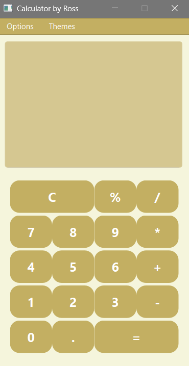
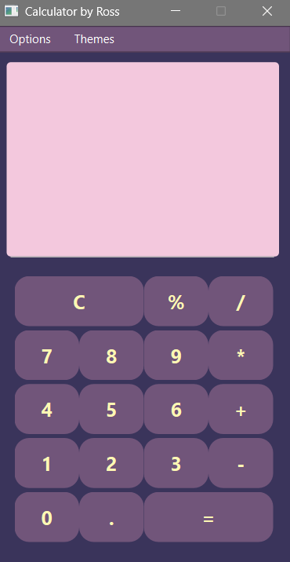
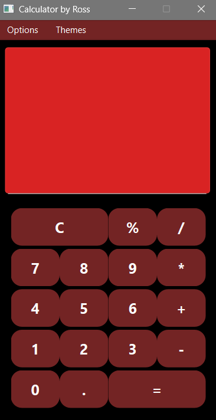
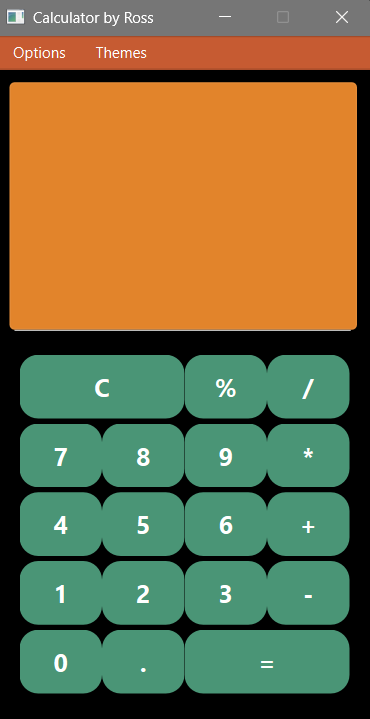
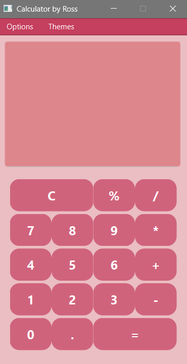

# calculator-pyqt6
A simple arithmetic calculator built with the PyQt6 framework. A personal project.

Features:
Basic arithmetic calculator features
Error handling (use the clear button to re-enable buttons)
Themes

## Themes

